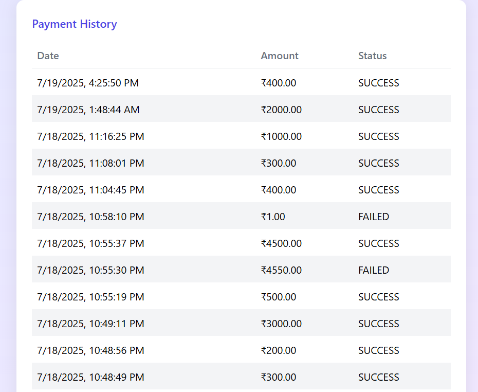

# Payment Collection App

A full-stack application for personal loan EMI collection, built with React, Node.js, Express, and MySQL.  
Deployed on AWS EC2 with CI/CD via GitHub Actions.

---

## **Table of Contents**
- [Features](#features)
- [Project Structure](#project-structure)
- [Setup Instructions](#setup-instructions)
- [Running Locally](#running-locally)
- [CI/CD Pipeline](#cicd-pipeline)
- [Deployment on AWS EC2](#deployment-on-aws-ec2)
- [API Endpoints](#api-endpoints)
- [Screenshots](#screenshots)
- [Contact](#contact)

---

## **Features**
- Responsive UI for loan customers
- Login, dashboard, payment form, payment history, confirmation modal
- REST API: customer details, payment submission, payment history
- Secure authentication (JWT), input validation
- MySQL database with normalized schema
- CI/CD with GitHub Actions
- Deployed on AWS EC2

---

## **Project Structure**
```
/frontend   # React app (UI)
  /src
  .env
  ...
/backend    # Node.js + Express API
  /controllers
  /models
  /routes
  .env
  ...
```

---

## **Setup Instructions**

### **1. Clone the Repositories**
```bash
git clone https://github.com/yourusername/payment-collection-frontend.git
git clone https://github.com/yourusername/payment-collection-backend.git
```

### **2. Install Dependencies**
- **Frontend:**
  ```bash
  cd payment-collection-frontend
  npm install
  ```
- **Backend:**
  ```bash
  cd payment-collection-backend
  npm install
  ```

### **3. Set Up Environment Variables**
- **Frontend (`frontend/.env`):**
  ```
  VITE_API_URL=http://localhost:5000
  ```
- **Backend (`backend/.env`):**
  ```
  DB_HOST=localhost
  DB_USER=your_db_user
  DB_PASSWORD=your_db_password
  DB_NAME=payment_collection
  JWT_SECRET=your_jwt_secret
  ```

### **4. Set Up the Database**
- Create the database and tables using MySQL:
  ```sql
  CREATE DATABASE payment_collection;
  USE payment_collection;
  -- Create customers and payments tables as per schema
  ```

---

## **Running Locally**

### **Backend**
```bash
cd payment-collection-backend
npm start
```
- Runs on [http://localhost:5000](http://localhost:5000)

### **Frontend**
```bash
cd payment-collection-frontend
npm run dev
```
- Runs on [http://localhost:5173](http://localhost:5173)

---

## **CI/CD Pipeline**

- **GitHub Actions** are set up in `.github/workflows/` in both repos.
- On every push or pull request to `main`/`master`, the following steps run:
  - Checkout code
  - Install dependencies
  - Build the project
  - (Optional: run tests)

---

## **Deployment on AWS EC2**

1. **Launch an Ubuntu EC2 instance** (open ports 22, 80, 5000).
2. **SSH into your instance:**
   ```bash
   ssh -i /path/to/key.pem ubuntu@your-ec2-public-dns
   ```
3. **Install Node.js, npm, git:**
   ```bash
   sudo apt update
   sudo apt install nodejs npm git -y
   ```
4. **Clone your repos:**
   ```bash
   git clone https://github.com/yourusername/payment-collection-backend.git
   git clone https://github.com/yourusername/payment-collection-frontend.git
   ```
5. **Set up backend:**
   ```bash
   cd payment-collection-backend
   npm install
   nano .env  # Add your environment variables
   npm start  # or pm2 start app.js
   ```
6. **Set up frontend:**
   ```bash
   cd ../payment-collection-frontend
   npm install
   nano .env  # Set VITE_API_URL to your EC2 public IP and backend port
   npm run build
   npm install -g serve
   serve -s dist -l 80
   ```
7. **Access your app:**  
   Visit `http://<your-ec2-public-ip>/` in your browser.

---

## **API Endpoints**

| Method | Endpoint                      | Description                        |
|--------|-------------------------------|------------------------------------|
| GET    | /customers                    | Get all customer loan details      |
| POST   | /payments                     | Make a payment                     |
| GET    | /payments/:account_number     | Get payment history for an account |

---

## **Screenshots**




*Payment Collection App - Modern UI with JWT Authentication and EMI Payment System*


## **Contact**
For any questions, contact:  
**Harikrishnan Aneesh**  
Email: harikrishnananish0@gmail.com
